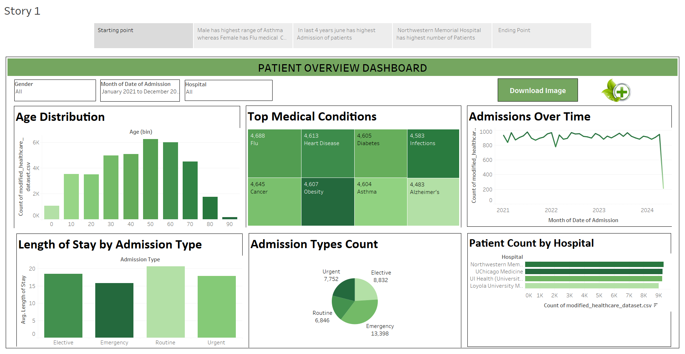

# HealthCare-Patients-Analysis

# Project Overview
Patient Overview Dashboard, provides a comprehensive visual analysis of patient admissions and health conditions across several hospitals. It is designed to help healthcare professionals and decision-makers gain insights into patient demographics, top medical conditions, hospital-wise admissions, and trends over time.

# Key Features
1.Age Distribution
Histogram showing the number of admitted patients across different age groups (in 10-year bins).

Largest age groups: 50–60 and 60–70.

2.Top Medical Conditions
Heatmap showing the most common conditions.

Top conditions include: Flu, Heart Disease, Diabetes, Infections, Cancer, and Obesity.

3.Admissions Over Time
Line chart visualizing patient admission trends from 2021 to 2024.

Seasonal and yearly fluctuations visible.

4.Length of Stay by Admission Type
Bar chart comparing average length of stay across admission types (Elective, Emergency, Routine, Urgent).

Routine stays are the longest on average.

5.Admission Types Count
Pie chart showing distribution across:

Emergency (13,398)

Elective (8,832)

Urgent (7,752)

Routine (6,846)

6.Patient Count by Hospital
Horizontal bar chart showing the number of admissions per hospital.

Top hospital: Northwestern Memorial Hospital.

# Key Insights
Male patients show a higher range of Asthma cases.

Female patients more commonly present with Flu.

June tends to see the highest number of admissions annually.

Northwestern Memorial Hospital handles the highest number of patients.

